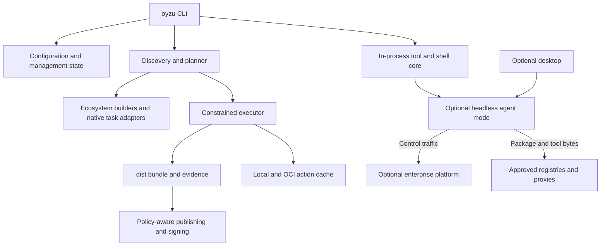

# Public architecture and repository boundaries

Status: draft. No source workspace exists yet.

Oyzu separates discovery and deterministic planning from acquisition, execution, evidence, and enterprise authorization. The same core supports terminal users, CI systems, automation, and the optional desktop.



## Proposed code layout

```text
crates/
  oyzu-cli/
  oyzu-core/
  oyzu-config/
  oyzu-tools/
  oyzu-environment/
  oyzu-tasks/
  oyzu-build/
  oyzu-executor/
  oyzu-builders/
  oyzu-artifacts/
  oyzu-cache/
  oyzu-agent/
  oyzu-connectors/
  oyzu-protocol/
apps/
  desktop/
examples/
  tools/
  environments/
  tasks/
  builds/
docs/
  vision/
  proposals/
  reference/
tooling/
```

These are logical module boundaries, not a requirement to create every crate before the first feature. Start with a small Rust workspace and split where ownership/testing justify it. Builder families can initially be modules. Avoid empty scaffolding that implies implementation.

`oyzu-cli` dispatches both ordinary commands and agent mode; reusable libraries do not depend on CLI argument parsing. The mise integration is pinned behind `oyzu-tools`/`oyzu-environment` boundaries. The public protocol has mock fixtures and no private dependency. The optional desktop uses React/TypeScript with a proposed Tauri shell.

## End-to-end responsibilities

| Phase | Owner | Durable result |
| --- | --- | --- |
| Select management state and configuration | Config + agent when managed | Effective settings and origins |
| Resolve tools/dependencies | Tools + builder preparation | Locks and verified input content |
| Discover targets/tasks | Builders + task resolver | Evidence-based target/task graph |
| Plan checks, variants, artifacts | Build planner | Immutable semantic plan |
| Execute with declared inputs | Executor | Action outcomes and output digests |
| Reuse safe computation | Cache | Verified original producer chain |
| Collect reports/artifacts | Artifacts | Finalized bundle manifest |
| Authorize publish/sign | Client plus enterprise server when managed | Current decision and separate receipts |

Cross-cutting concerns include cancellation, structured errors, redaction, filesystem/path safety, capability negotiation, and correlation IDs. Core operations expose machine-readable results without making humans parse raw JSON for ordinary use.

## Dependency rules

Builders cannot bypass the acquisition router, sandbox, manifest collector, or mandatory authorization. Task overrides change commands within those boundaries. The desktop cannot acquire upstream secrets directly. The public product cannot require the private platform. Agent-less standalone operation remains a supported path.

The first implementation should prove one complete vertical slice before introducing a plugin ABI or distributed execution protocol. [Delivery sequencing](delivery.md) explains the proposed slices.
